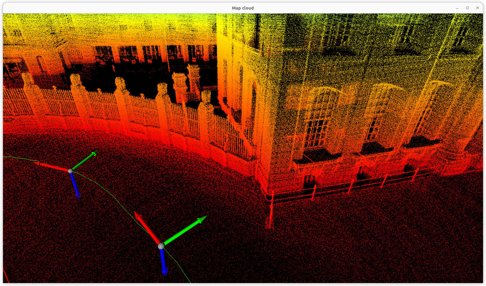

# ESKF-LIO

This repository contains Loosely coupled Lidar-IMU Odometry based on Error-State Kalman Filter.

The implementation of ESKF is based on [Quaternion kinematics for the error-state Kalman filter](https://arxiv.org/pdf/1711.02508.pdf).

Key Features:
- Utilizes a Voxel Grid based on a hash table to store local map points.
- Applies an [SVD-based ICP algorithm](https://igl.ethz.ch/projects/ARAP/svd_rot.pdf) for registration.

## Installation

### Dependencies
- Ubuntu 22.04
- ROS2(humble)
- Open3d
- Yaml-cpp
- Eigen3
- OpenMP

### Install HILTI-OXFORD Dataset
[Hilti-SLAM-Challenge-2022](https://hilti-challenge.com/dataset-2022.html)

- Download [Exp21 Outside Building](https://storage.googleapis.com/hsc2022/exp21_outside_building.bag)


### Convert rosbag1 to rosbag2

- [rosbag convert](https://ternaris.gitlab.io/rosbags/topics/convert.html)

```bash
rosbags-convert exp21_outside_building.bag
```

### Clone the repository
```bash
cd /your/workspace/src
git clone https://github.com/LimHaeryong/ESKF_LIO.git
```

### Modify rosbag path
- modify launch/eskf_lio.launch.py
```python
    play_rosbag = ExecuteProcess(
        cmd=['ros2', 'bag', 'play', 'change/to/your/rosbag/path']
    )
```

### Colcon Build
```bash
cd /your/workspace
colcon build
source ./install/local_setup.bash
```

## How to run   

- Odometry

It generates the odometry information, including the point cloud map (map_cloud.pcd) and trajectory data (trajectory.json), which will be created in the "resources" directory.
```bash
ros2 launch eskf_lio eskf_lio.launch.py 
```
- Visualize Map Cloud
```
ros2 run eskf_lio eskf_lio_visualize_map_cloud
```
## Result



